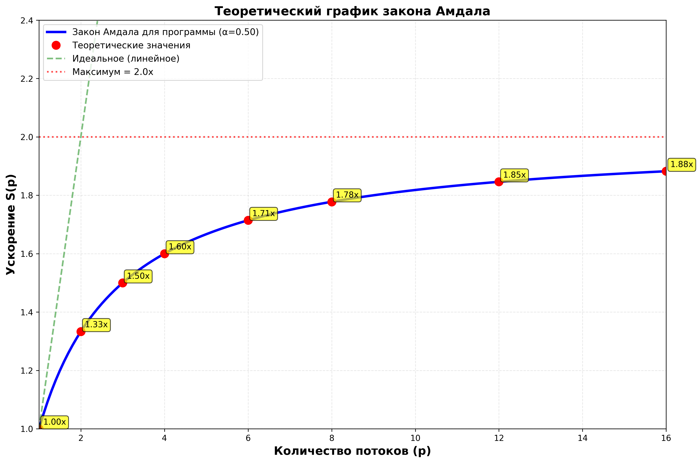
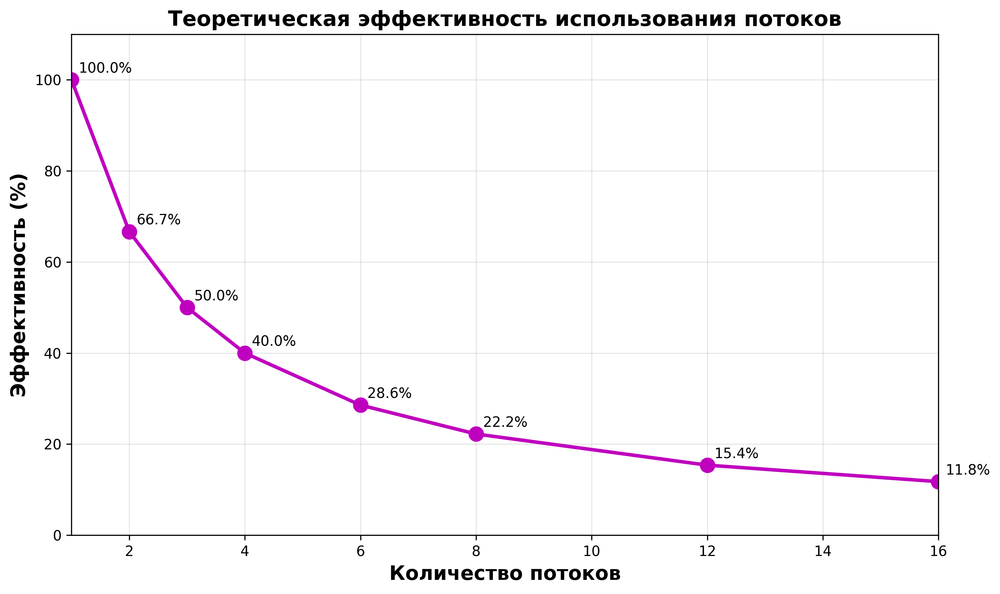
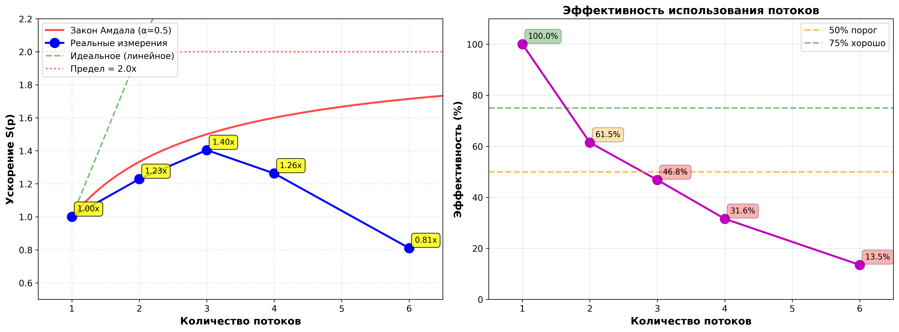
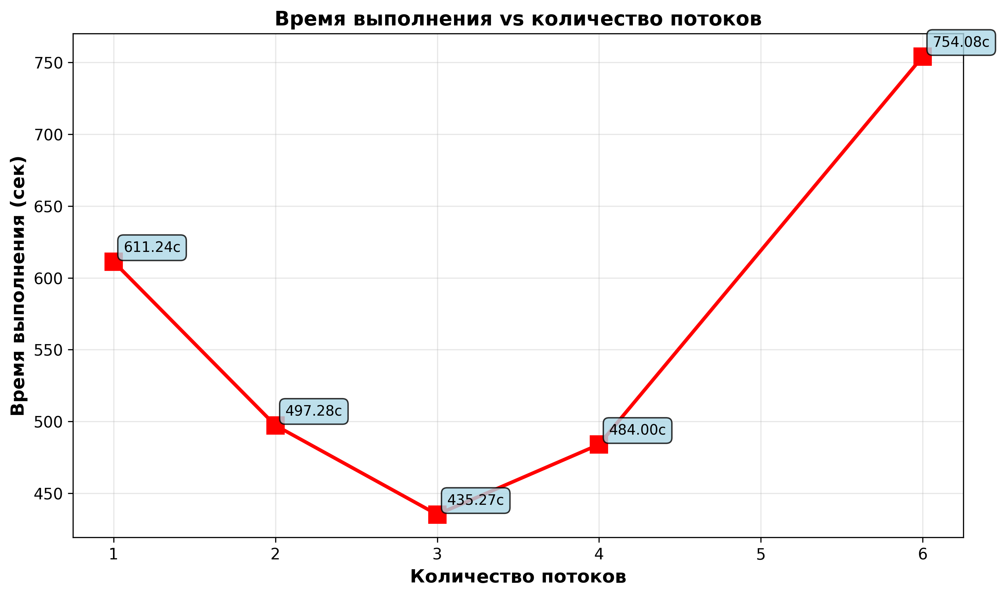
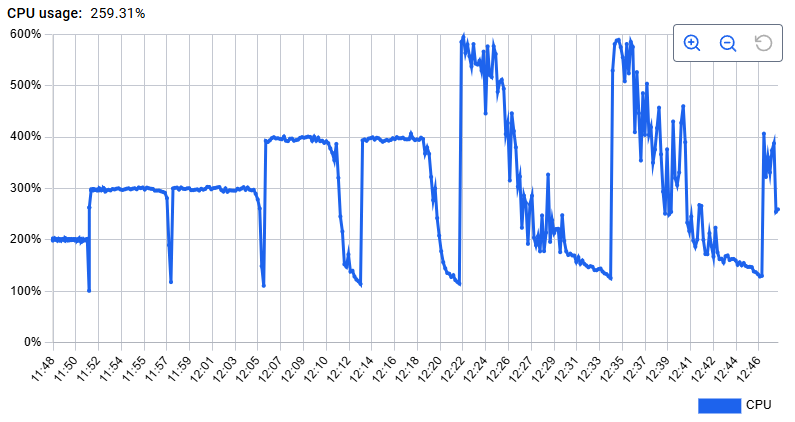

# Лабораторная работа №2

## Задание (Вариант №10)

Реализовать параллельный алгоритм решения системы линейных алгебраических уравнений (СЛАУ) методом Гаусса с использованием многопоточности. Провести анализ производительности и сравнить с теоретическим законом Амдала.

### Debug
`g++ -std=c++11 -pthread -g -O0 main.cpp src/thread_pool.cpp -Iinclude -o gauss_debug`
`gdb ./gauss_debug`
```
break main
break gauss
break normalize_row_task
break subtract_from_task
break ThreadPool:worker
```
`run < inputdata.txt`

`tui enable`

### Build Benchmark
`g++ -std=c++11 -pthread -O2 -Iinclude benchmark.cpp ../src/gaussian.cpp ../src/thread_pool.cpp -o benchmark`

### Build Matrix Generator
`g++ -std=c++11 -o generate_matrix generate_matrix.cpp`

### Посмотреть количество потоков

`./main_exe -t 5 < ../inputdata2500.txt &`

`ps aux | grep main_exe`

`cat /proc/$!/status | grep Threads`

или

`cat /proc/<PID>/status | grep Threads`

---

## Отчёт

### Теоретический график закона Амдала (доля последовательного кода α=0.5)


Формула:

$S_p = \frac{1}{\alpha+\frac{(1-\alpha)}{p}}$

где $(1-\alpha)$ - доля параллельного кода, $p$ - количество потоков


### Теоретический график эфффективности (доля последовательного кода α=0.5)


Формула:

$E_p = \frac{S_p}{p}$

где $p$ - количество потоков

Как видим на графике, теоретическое оптимальное количество потоков - это 8. Большее количество

Далее проверим это на практике.

### График бенчмарка для матрицы 10000 на 10000


Из графика видно, что на матрицах размера 10000 на 10000, оптимальное количество потоков - это 3. Далее, чем больше потоков, тем меньше ускорение и эффективность использования потоков.

На бОльших матрицах график будет больше приближен к теоретическому.


График времени исполнения от количества потоков



### График загруженности потоков в бенчмарке (2 прогона для каждого теста)


Как мы видим, уже на 6 потоках (начиная с 12:22 видим в пиках загруженность близкую к 600%, что как раз означает 6 потоков) график становится очень рваным - потоки конкурируют за задачи и выигрыш от многопоточности перекрывается накладными расходами на синхронизацию потоков.

---

### Выводы

Во время проектирования многопоточной системы важно оптимально разделить алгоритм на независимые подзадачи, а также подобрать подходящую архитектуру решения (выбрать какой-либо паттерн либо вовсе отказаться от них).

В моем случае паттерн WorkerPool - неудачное решение, т.к. он перекрывает выигрыш от многопоточки накладными расходами на синхронизацию, поэтому практические графики будут приближаться к теоретическим только на очень больших размерах входных данных.

#### Чуток Про многопоточку:

Многопоточность позволяет:
- повысить производительность процесса за счёт разделения алгоритма на независимые подзадачи
- упростить паралелльное взаимодействие за счёт использования общего адресного пространства (в отличии от взаимодействия процессов)

Но в тоже время несёт в себе проблемы синхронизации (предотвращаем race condition), а также сложности отладки и поиска ошибок в программе. Ну и конечно болячки, как взаимоблокировки (DeadLock'и и Livelock'и)

<details>
<summary>⚠️⚠️Spoiler warning⚠️⚠️</summary>

</details>
